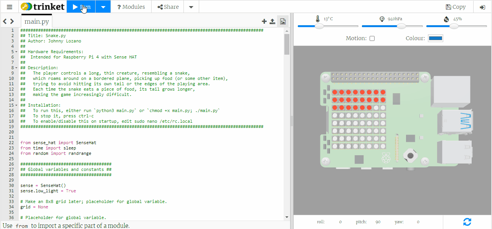
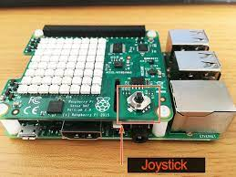

# Snake.py

## Description:
The player controls a long, thin creature, resembling a snake, which roams around on a bordered plane,
picking up food (or some other item), trying to avoid hitting its own tail or the edges of the playing area.
Each time the snake eats a piece of food, its tail grows longer, making the game increasingly difficult. The player moves the
snake with the left, right, up, and down directions on the joystick of the Sense HAT.

## Hardware Requirements:
Intended for Raspberry Pi Model 4 with Sense HAT

## Installation:
(Operate from Raspberry Pi command terminal or from Remote SSH connection)
- To run this, either run `python3 Snake.py` or `chmod +x Snake.py; ./Snake.py`
- To stop it, press ctrl-c
- To enable/disable on startup, edit sudo nano /etc/rc.local

